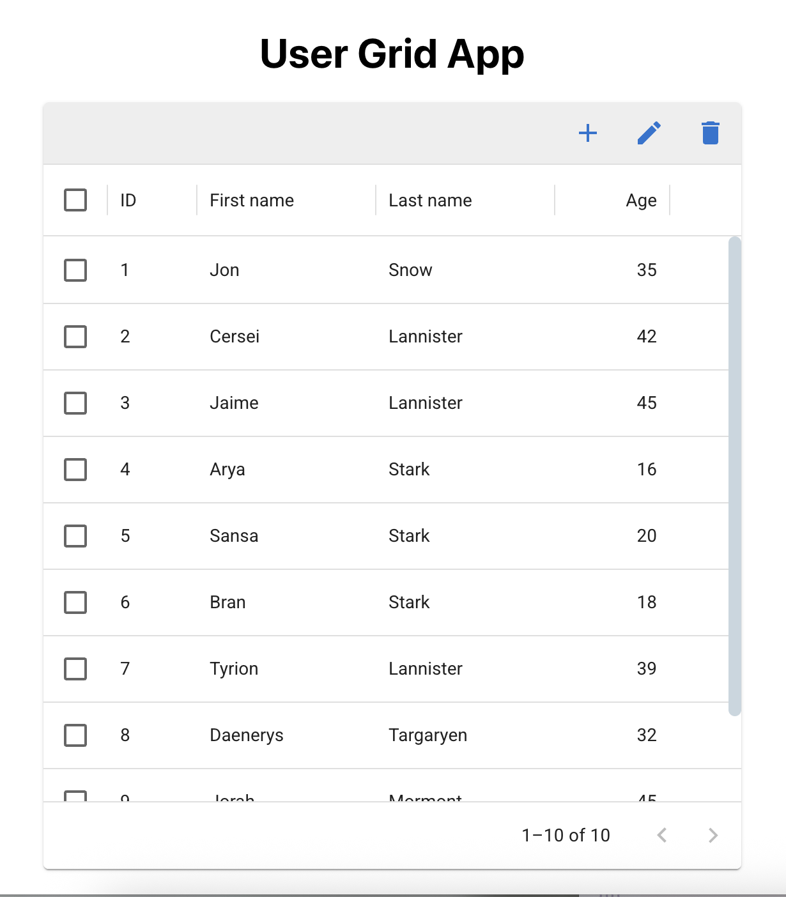

# React MUI crud

**Project:** _User Grid App_   
**Version:** 1.0  
**Author:** Saya Yoshida  
**Date:** [ Nov 2025]  
**Live Demo:**　https://sayanida.github.io/react-mui-crud/ 

<!-- A simple TodoList application built with **React**.  
You can add, complete, and delete tasks easily.   -->

## Features
<!-- - Add new tasks
- Mark tasks as completed
- Delete completed tasks
- Remaining task count display -->

## Screenshot
